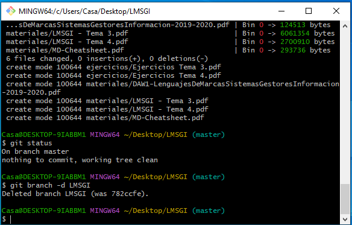

# Practica Recuperacion de GitHub Borja Torres Tortillol

## 
Parte de Git Bash

### Bash del Repositorio de Bases de Datos:

* Init incial
* Commit Inicial "Repositorio de Bases de Datos Creado"
* Creamos el Documento leeme.txt y lo añadimos

* Commit Contenidos creados

* Creamos la rama BBDD y creamos las carpetas contenedoras
* Añadimos las carpetas
* Hacemos el Correspondiente Commit "Directorios Creados"

* Cambiamos a la Rama BBDD y añadimos los contenidos (Los contenidos han sido añaidos sin comandos)

* Añadimos los Materiales y Ejercicios 

* Cambiamos a la Rama Master, Hacemos el correspondiente Merge y eliminamos la rama BBDD

* Mostramos el Git Log del repositorio

### Bash del Repositorio de Entorno de Desarollo:
* Git Init Inicial

* Creamos el fichero leeme.txt

* Añadimos el fichero y hacemos el Primer Commit con el archivo añadido

* Creamos los Directorios

* Añadimos los Materiales y Ejercicios y hacemos el Commit

* Creamos la Rama ED y cambiamos a la Rama ED

* Añadimos los Materiales 

* Hacemos el Commit de "Materiales Añadidos"

* Añadimos los Ejercicios

* Hacemos el Commit de "Ejercicios Añadidos"

* Hacemos el Correspondiente Git Log

### Bash del Repositorio de Lenguaje de Marcas:

* Git init incial

* Commit inicial "Commit Inicial"

* Fichero leeme.txt

* Creamos las Carpetas Materiales y Ejercicios

* Git Commit "Contenidos Añadidos"

* Creamos la rama LMSGI

* Cambiamos a la Rama LMSGI

* Añadimos los contenidos de las carpetas

* Git Add Ejercicios

* Git Add Materiales

* Hacemos un Git Status

* Hacemos un Git Commit

* Hacemos el Checkout y cambiamos a la Rama Master Y hacemos el correspondiente Merge

* Eliminamos la Rama LMSGI

### Bash del Repositorio de Programacion:

* Hacemos el Git Init correspondiente

* Creamos el Archivo leeme.txt

* Añadimos el Archivo

* Creamos las Carpetas y las Añadimos

* Hacemos el siguiente Commit "Contenidos Añadidos"

* Creamos la Rama PROG y cambiamos a esa Rama

* Añadimos los Ejercicios Y Materiales

* Commit Contenidos Añadidos 

* Cambiamos a la rama Master y hacemos un Merge y eliminamos la Rama PROG

### Bash del Repositorio de Sistemas Informaticos:

* Git Init Inicial

* commit Inicial

* Creamos el fichero.txt y las carpetas

* Añadimos tanto carptetas como ficheros 

* Y el correspondiente Commit 

* Creamos la Rama SI y cambiamos a esa Rama

* Añadimos los materiales

* Commit de Materiales añadidos

* Cambiamos a la Rama Master y hacemos el Merge y eliminamos la rama SI

* Git log Corrspondiente

## 
Parte de Git En Visual Studio Code

### VS del Repositorio de Base De Datos:

* Añadimos la carpeta Practicas y la publicamos al Github

* Repositorio en Git Hub

### VS del Repositorio de Entorno de Desarrollo:

* Añadimos la carpeta Practicas y la publicamos al Github

* Repositorio en Git Hub

### VS del Repositorio de Lenguaje de Marcas:

* Añadimos la carpeta Practicas y la publicamos al Github

* Repositorio en Git Hub

### VS del Repositorio de Programacion:

* Añadimos la carpeta Practicas y la publicamos al Github

* Repositorio en Git Hub

### VS del Repositorio de Sistemas Informaticos:

* Añadimos la carpeta Practicas y la publicamos al Github

* Repositorio en Git Hub

## 
Parte Creacion de Perfil En GitHub

* He reusado Materiales de la Practica antes de la recuperacion:

